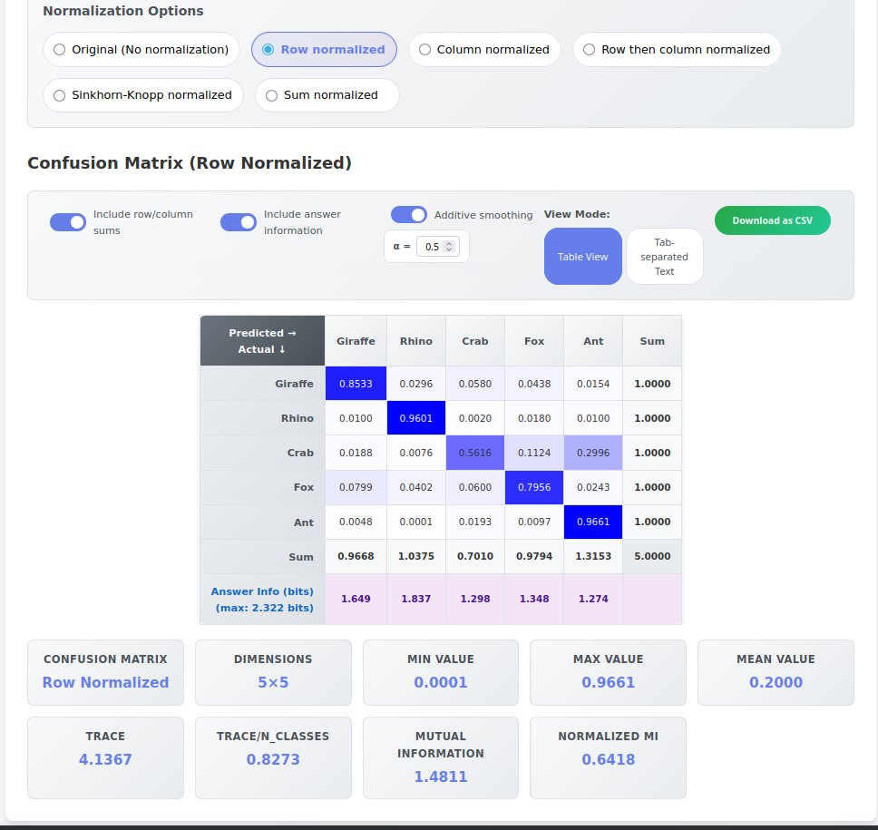
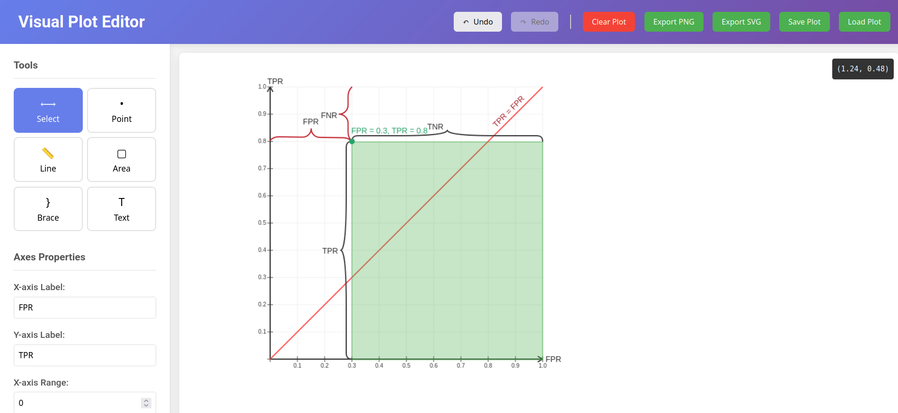

# Hi
My name is Roman Shchedrin. I work as ML dev and vibe-code at my free time. I've implemented some ideas.

## Contents
- [Short term memory speed](#Short-term-memory-speed)
- [Word Typing](#word-typing)
- [Confusion Matrix Page](#confusion-matrix-page)
- [Newcomb](#newcomb)
- [Visual Plot Editor](#visual-plot-editor)
- [Is aleatory](#is-aleatory)

### Short term memory speed
This page allows to measure your short-term memory speed. It was intendend to clearly show that short term memory is fast. I can easily recall 4 letter sequences with 100ms show time and 100ms delay.

[Page](https://rashchedrin.github.io/short_term_memory_speed/)
[GitHub](https://github.com/rashchedrin/short_term_memory_speed)

### Word Typing
This page was intended to practice password typing. It's a short single HTML file without any external dependencies, and you can ask any LLM to audit it or audit it yourself. It has audio feedback so you can practice blindfolded. Personally, for ordinary typing practice I'd recommend to use https://monkeytype.com/ instead - you can configure it to behave in practically any way you want.

[Page](https://rashchedrin.github.io/word_typing/)
[Github](https://github.com/rashchedrin/word_typing)

### Confusion Matrix Page
On this page you can play with different confusion matrix normalizations and metrics. It has info buttons everywhere so I hope it's a good learning material. My personally favorite metric is normalized mutual information after Sinkhron-Knopp normalization with additive smoothing at alpha=0.5 which is Jeffrey's prior over Dirichlet distribution. It's correctness is philosophically fascinating.

[Page](https://rashchedrin.github.io/confusion_matrix_page/)
[Github](https://github.com/rashchedrin/confusion_matrix_page)

### Newcomb
Newcomb's paradox simulation implemented as a HTML+JS page. An oracle is observing your behavior and draws conclusion about your intention. If it predicts that you'll take both envelopes, then one envelope contains $1'000 and the other contains $0. If it predicts that you'll take only envelope A, then envelope A contains $1'000'000, and envelope B contains $1'000. Test your decision theory for free!

[Page](https://rashchedrin.github.io/newcomb/)
[Github](https://github.com/rashchedrin/newcomb)

### Visual Plot Editor
I needed to make some plots for my notes about ROC diagrams, but desmos doesn't allow to add free-form annotations. So I vibecoded this editor. Now it can add lines, points, braces and areas - everything I needed for a one specific plot. Maybe I'll extend it later.

[Page](https://rashchedrin.github.io/draw_plot/)
[Github](https://github.com/rashchedrin/draw_plot)

### Is aleatory
It turns out that by probabilities and outcomes I can test whether or not those probabilities are aleatory or epicstemic. This allows me to dismiss one of the versions of solipsism, and a claim that prediction markets confidences are probabilities of those events. 
[Github](https://github.com/rashchedrin/is_aleatory)